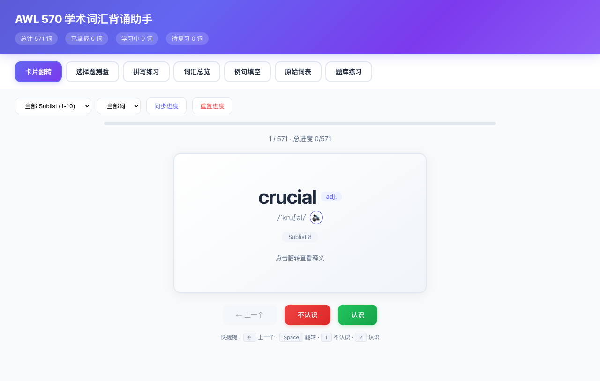
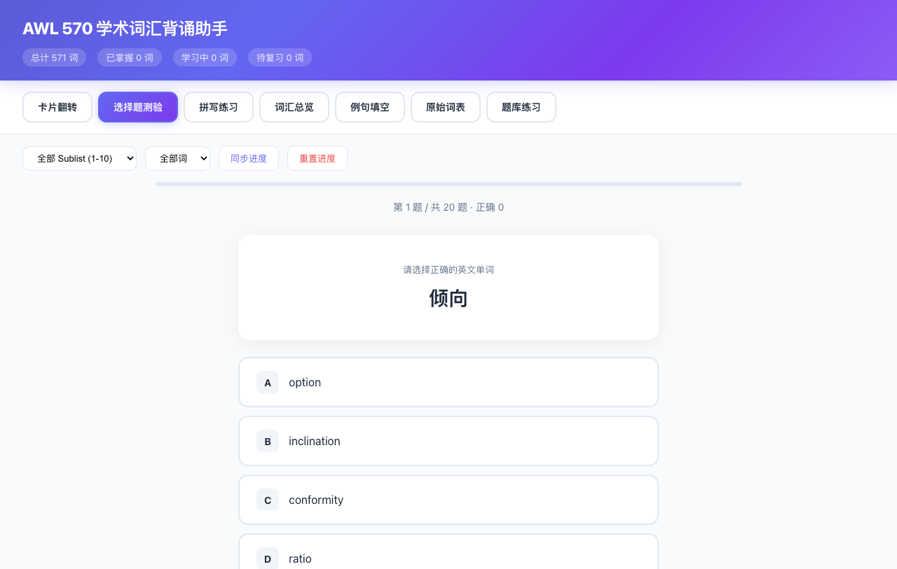
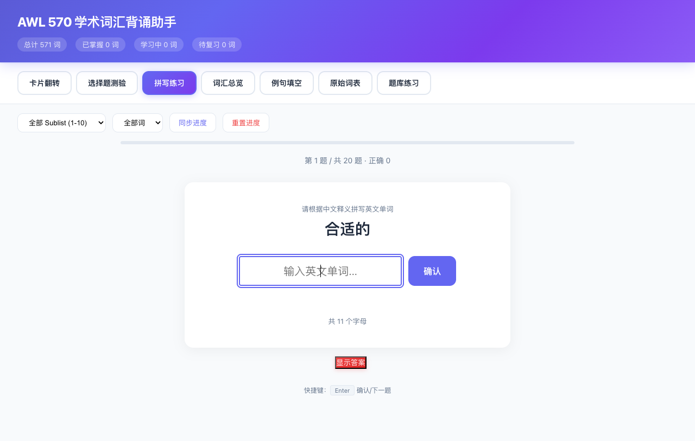
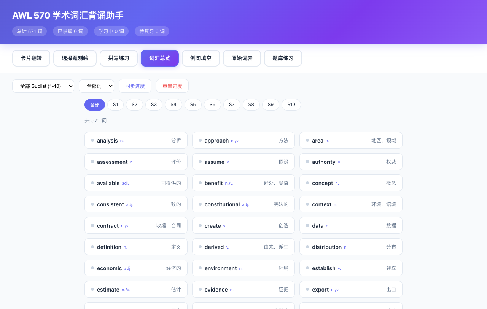
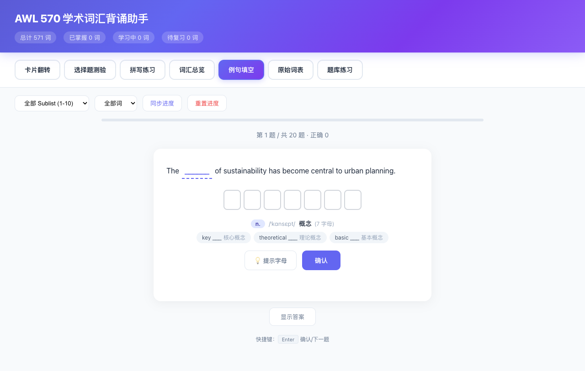
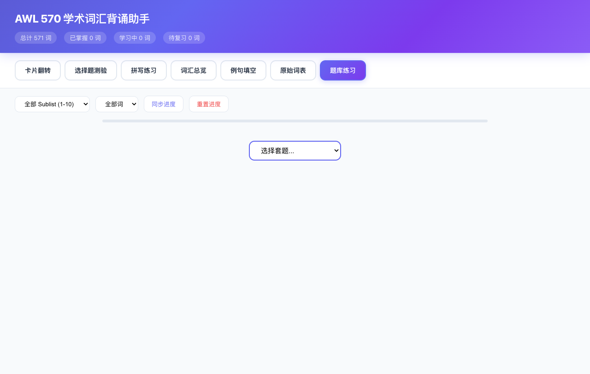

# AWL 570 学术词汇背诵助手

> 为备考中国科学院大学（UCAS）MOOC 英语在线考试而开发，基于 AWL（Academic Word List）570 词族的一站式词汇学习工具

**在线使用 → https://ultraclr.github.io/570words/**

## 项目背景

国科大 MOOC 英语课程中，学术英语阅读和写作对 AWL 词汇有较高要求。AWL 涵盖学术场景中最常用的 570 个词族，是读懂论文、完成考试的核心基础。市面上的背单词 App 很少有专门针对 AWL 的，更缺乏同时提供多种练习模式的工具，因此开发了这个应用。

## 功能特性

7 种学习模式，覆盖词汇记忆的完整链路：

| 模式 | 说明 |
|:---:|------|
| 卡片翻转 | 英→中翻卡，快速刷词，标记"认识/不认识" |
| 选择题测验 | 四选一选择题，即时反馈正误 |
| 拼写练习 | 听音/看中义，手动拼写单词 |
| 词汇总览 | 全量词表浏览，按 Sublist 分组，支持搜索 |
| 例句填空 | 真实例句挖空，语境中巩固词义 |
| 原始词表 | AWL 570 完整词族数据，含词性、派生词 |
| 题库练习 | 模拟 MOOC 考试场景的段落填空题库 |

## 其他亮点

- **Sublist 筛选**：按 1-10 分组过滤，优先学最高频词
- **进度持久化**：学习进度自动保存到 localStorage，刷新不丢失
- **发音支持**：每个单词附带 IPA 音标和发音按钮
- **派生词**：展示常见派生形式，帮助构建词汇网络
- **响应式设计**：适配手机、平板、桌面各种屏幕
- **纯前端单文件**：无需后端，打开 `index.html` 即可使用

## 截图预览

<div align="center">

| 卡片翻转 | 选择题测验 | 拼写练习 |
|:---:|:---:|:---:|
|  |  |  |

| 词汇总览 | 例句填空 | 题库练习 |
|:---:|:---:|:---:|
|  |  |  |

</div>

## 快速开始

### 在线使用

直接访问 https://ultraclr.github.io/570words/ ，无需安装任何东西。

### 本地运行

```bash
git clone https://github.com/UltraClr/570words.git
cd 570words
# 用任意 HTTP 服务器打开，或直接用浏览器打开 index.html
python3 -m http.server 8080
# 访问 http://localhost:8080
```

## 技术架构

整个应用是一个 **单文件 HTML**（~430KB），包含全部 CSS、JavaScript 和词汇数据，无外部依赖。

- **HTML/CSS/JS** 全部内联在 `index.html` 中
- **数据存储**：词汇数据以 JSON 数组形式内嵌在 JS 中
- **进度存储**：使用浏览器 `localStorage`
- **部署**：GitHub Pages，push 即上线
- **辅助文件**：`phonetics.js`（音标数据）、`pos.js`（词性数据）、`derivatives.js`（派生词数据）

## 数据来源

- **词汇列表及中文释义**：来自国科大（UCAS）课程资料《学术词汇570词（带中文释义）》
- **音标**：IPA 国际音标
- **题库**：基于 AWL 词汇构造的段落填空练习

## License

MIT
